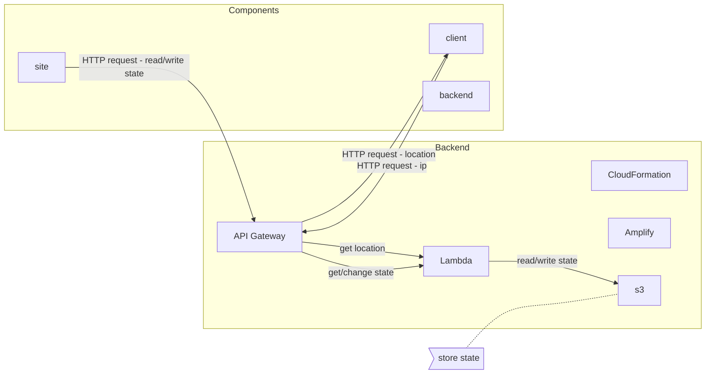
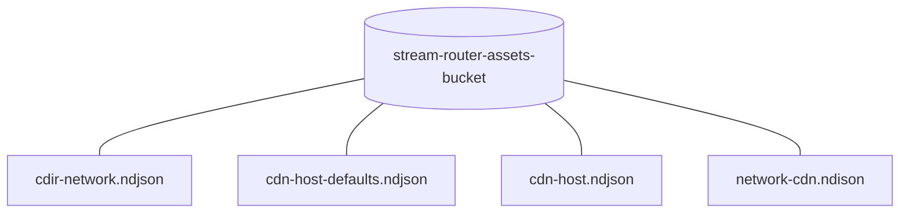

# stream-router
Take home project


### Spec: 
- You’ll need to create an API which accepts an IP address and returns the best location for that IP address to retrieve a stream from. 
- Use Node/Typescript, Lambda functions and if possible CloudFormation
```
GET /?ip=1.2.3.4 
{
“host”: “A-001” 
}
```
Each IP range will fall into 3 different networks, you’ll be provided several CIDR ranges to map each IP to a network:
```
{"cidr" : "10.0.0.0/7", "network”: 1}
{"cidr" : "12.0.0.0/6", "network”: 2}
{"cidr" : "16.0.0.0/4", "network”: 3}
{"cidr" : "32.0.0.0/3", "network”: 2}
{"cidr" : "64.0.0.0/3", "network”: 1}
{"cidr" : "96.0.0.0/4", "network”: 1}
{"cidr" : "112.0.0.0/5", "network”: 2}
{"cidr" : "120.0.0.0/7", "network”: 1}
{"cidr" : "122.0.0.0/8", "network”: 3}
{"cidr" : "123.0.0.0/32", "network”: 1}
```
You’ll be provided several sites in the format of:
```
{"CDN": “A”, "cidr": "112.2.0.0/15", "host": "A-001"}
{“CDN”: “B”, "cidr": "32.5.0.0/16", "host": "B-001"}
{"CDN": “A”, "cidr": "112.4.0.0/32", "host": "A-002"}
{"CDN": “B”, "cidr": "32.7.0.0/32", "host": "B-002"}
```
And default routes specified the same, but without a cidr range attached:
```
{"CDN": “B”, "host": "B-1023"}
{"CDN": “C”, "host": "C"}
```

- All the above configuration will be provided as files of new line delimited JSON objects which you’ll need to be able to ingest and process
- Create a web interface for each of the 3 different networks where I can select each network to go to CDN A, B or C as a toggle. 
- The web interface should also have a panel to use the query function

Summary:
- I have IP address X
- Which network is X in? Suppose it’s 2
- Which CDN is serving network 2? Suppose it’s B
- Which host for CDN B matches this IP? Suppose none do, Return the default route


---
### Architecture:

AWS Services Used: | Name
--- | ---
AWS::ApiGateway::RestApi | Api
AWS::ApiGateway::Deployment | ApiDeployment
AWS::ApiGateway::Stage | ApiProdStage
AWS::Amplify::App | AmplifyAppAdminConsole
AWS::Amplify::Branch | AmplifyBranchAdminConsole
AWS::S3::Bucket | BucketAssets
AWS::S3::Bucket | BucketDeployment
AWS::Lambda::Function | LambdaMappingSet
AWS::Lambda::Function | LambdaMappingGet
AWS::Lambda::Function | LambdaRoute
AWS::Lambda::Permission | LambdaMappingGetGetRequestPermissionProd
AWS::Lambda::Permission | LambdaMappingSetPostRequestPermissionProd
AWS::Lambda::Permission | LambdaRouteGetRequestPermissionProd
AWS::IAM::Role | RoleAmplify
AWS::IAM::Role | RoleLambda
AWS::DynamoDB::Table | TableMappings

AWS Diagram:
<!-- generated by mermaid compile action - START -->

<details>
  <summary>Mermaid markup</summary>



</details>
<!-- generated by mermaid compile action - END -->

<!-- generated by mermaid compile action - START -->

<details>
  <summary>Mermaid markup</summary>



</details>
<!-- generated by mermaid compile action - END -->

---
### API:

**Endpoint 1**: Get Route for IP - `GET route/?ip=1.2.3.4`
```
curl -X GET -G \
'https://msbhl0oai9.execute-api.ap-southeast-2.amazonaws.com/Prod/route' \
-d ip=1.2.3.4
```
```
{
  “host”: “A-001”
}
```

**Endpoint 2**: Get Mappings for Network to CDN - `GET mapping-get/`
```
curl -X GET \
'https://msbhl0oai9.execute-api.ap-southeast-2.amazonaws.com/Prod/mapping-get'
```
```
{
  "mappings": [
    { "network": 1, "cdn": "A" },
    { "network": 2, "cdn": "B" },
    { "network": 3, "cdn": "C" }
  ]
}
```

**Endpoint 3**: Set Mappings for Network to CDN - `POST mapping-set/?network=1&cdn=A`
```
curl -X POST -G \        
'https://msbhl0oai9.execute-api.ap-southeast-2.amazonaws.com/Prod/mapping-set' \
-d network=1 \
-d cdn=A
```
```
{
  "status": “success”
}
```
