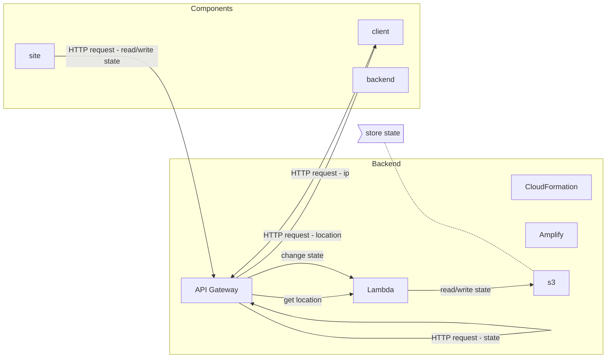

# stream-router

 Architecture Diagram:
 

```mermaid
graph LR
    subgraph Backend
        CloudFormation
        Lambda
        Amplify
        APIGateway[API Gateway]
        s3
    end
    subgraph Components
        client
        site
        backendd[backend]
    end
    client -->|HTTP request - ip| APIGateway
    APIGateway -->|HTTP request - location| client
    site -->|HTTP request - read/write state| APIGateway
    APIGateway -->|HTTP request - state| APIGateway
    APIGateway -->|get location| Lambda
    APIGateway -->|change state| Lambda
    Lambda -->|read/write state| s3

    note1>store state]
    note1 -.- s3
```
